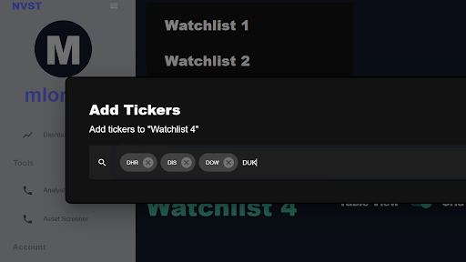

# Stock_Market_Senior_Project

This web-app was built by Schuyler Asplin, Michael Lorhan, Matthew Szymanski, Ocean Oestreicher.

Our design goal was to create a stock market analysis tool that parses through and presents available stock information to users in an easy to read way.

To run the project, you'll need

-   python3, pip, and node.js
-   API keys for finnhub and yahooquery
-   A new database connection (the AWS server the school provided will likely be outdated when you are running this project)
-   Postman isn't necessary but will be useful for anyone developing on the backend.

Once these are in place, you can run the project by following these steps:

1. cd into backend/ and run 'pip install -r requirements.txt' to install the python dependancies
2. in the same window, run 'python3 main.py'
3. open a new command prompt/ terminal window
4. cd into frontend/ and run 'npm i' to install the node dependancies,
5. run 'npm start' to run the front end locally

# UI

You'll need to create an account and log in to view the features:

Next you can create watchlists to organize and track assets you're interested in. We've implemented full CRUD operations of the watchlists that automatically refresh once the change is made to the database:

Use the Asset Screener to view price charts and detailed information about a company including valuation metrics, financials, and insider trades:

A user can manage account details from the 'Manage Account' section:

# Backend Architecture

-   The Flask server is set to run on port 8080, but this can be changed in main.py
-   Each endpoint is a separate resource. The routes available to the frontend need to be added to the api instance in main.py.
-   endpoints.py is where the actual endpoints are kept. They grab the URL params and pass them into service method which handle the business logic. In the future, middleware can be added here.
-   Services handle business logic and are located in the services folder
-   config/database.py contains the methods that initializes database connections. db_controller.connect() is called by every services that interacts with the database. Start here if you want to change the database connection.
-   CORS is disabled to allow for easier development
-   utilities/postman_collection.json file that you can use to test the endpoints on your own.

# Frontend Architecture

-   src/config/WebcallAPI.tsx holds the webcall strings, as well as the abort controller methods. This increases the readability of the fetch/ axios calls, and allows for greater modularity/ reusability when interacting with the backend.
-   src/scenes/ contains pages that we thought would take up an entire screen.
-   src/scenes/global holds components that are present on every page/ screen.
-   src/components/ holds components that are intended to be reusable throughout the website (they haven't stayed that way unfortunately)
-   src/theme.tsx holds the global theme information for color palette, fontsizes, global MUI overrides, breakpoints, and light/ dark mode settings.

We didn't do any significant unit testing on the front or back end given the short nature of the project, but it's already at the point where future development would benefit greatly from sticking to Test Driven Development principles.

Please note that frontend/ and backend/ have their own respective .gitignores.
